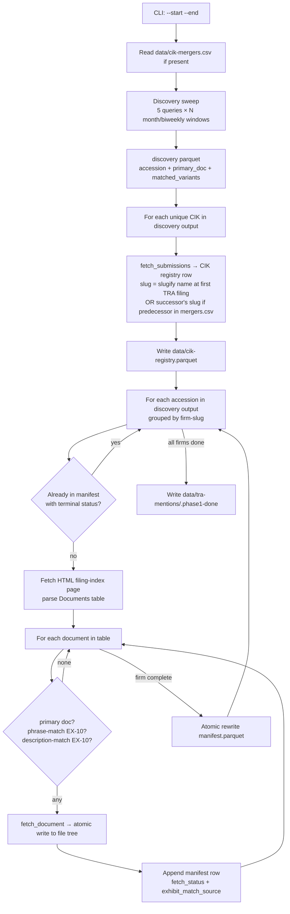

# feat: Phase 1 discovery and acquisition pipeline

## Summary

Implement Phase 1 of the per-firm narrative TRA pipeline as a small Python package under `scripts/phase1_discovery/`, mirroring the structure of the existing `scripts/sec_edgar/` package. The implementation wraps the existing `EdgarClient` with five components (discovery sweep, CIK registry, index-first acquisition, manifest, done marker) plus a CLI driver that orchestrates them. Each module ships with a `_self_test()` block matching the existing project convention; no separate test directory or mocking framework is introduced.

---

## Problem Frame

The TRA database build (`docs/workflow-goal.qmd`) needs a per-firm corpus of every EDGAR filing that meaningfully mentions a Tax Receivable Agreement, and the pre-pivot scripts in this repo discover by EX-10 exhibit hit instead of by filing, never fetch primary documents, key by CIK instead of firm-slug, and have no contract with downstream phases about completeness or readiness. The full pain shape lives in `docs/brainstorms/2026-05-25-phase-1-requirements.md` Problem Frame.

---

## Requirements

This plan covers every requirement in the origin brainstorm (R1-R16) with two deliberate divergences from origin text resolved during HITL review: R5's `state_of_inc` field is dropped (no downstream consumer; see Key Technical Decisions), and R8's data source changes from `index.json` to the HTML filing-index page (origin's `index.json` does not carry the `description` field origin R9 depends on). The origin document is not auto-updated to reflect these divergences; the plan supersedes it on implementation details. Group-level mapping to implementation units below; per-unit traceability is in each unit's `**Requirements:**` field.

- **Discovery** (R1-R4): U2 (constants and windows), U3 (sweep)
- **Identity & registry** (R5-R7): U4
- **Acquisition** (R8-R10): U5
- **Output and handoff** (R11-R14): U6
- **Restart and idempotency** (R15, R16): U6, U7

**Origin actors:** A1 (Phase 1 operator), A2 (Phase 2 reading agent), A3 (EDGAR), A4 (merger-CSV maintainer).
**Origin flows:** F1 (historical build), F2 (restart after interruption), F3 (merger CSV updated and run again).
**Origin acceptance examples:** AE1 (covers R3), AE2 (covers R7), AE3 (covers R6/R7), AE4 (covers R9), AE5 (covers R12/R14), AE6 (covers R15/R16).

---

## Scope Boundaries

(All carried verbatim from the origin brainstorm.)

- Phase 5 refresh primitives (Submissions-API polling per known CIK, daily-index walk for new CIKs, SEC RSS for real-time triggers) — Phase 1 is stateless over its date range; Phase 5 invokes Phase 1 with the right date range.
- Pre-2001 filings — outside the EDGAR full-text search index lower bound.
- Automated predecessor/successor CIK detection from 8-K Item 2.01 narrative — Phase 2's reader surfaces candidates; operator updates `data/cik-mergers.csv` manually.
- HTML-to-markdown cleanup of fetched documents — `.claude/skills/tra-htm-to-md/` skill, not Phase 1.
- Reading filings narratively (Phase 2), cross-firm consolidation (Phase 3), per-firm and per-TRA timelines plus structured database tables (Phase 4).
- Recursive bisection of overflow windows keyed on `total.relation == "gte"` plus a persistent windows table — dropped in HITL ideation review; heuristic 10k-hit-count halving in R3 is sufficient.
- Pre-filtering filings for TRA substance — Phase 1 saves any filing meeting the discovery query; Phase 2 makes the substance call.
- Streaming per-firm handoff — Phase 1 is batch (R14); Phase 2 reads only after the done marker fires.
- Concurrent Phase 1 invocations against the same output directory — single-process by EdgarClient rate-cap constraint.

### Deferred to Follow-Up Work

- Cleanup of pre-pivot `scripts/find_candidates.py`, `scripts/pull_exhibits.py`, `scripts/tra_download.py`, `scripts/tra_master_cik_list*.py`, `scripts/tra_refined_master.py`, `scripts/tra_body_vs_exhibit.py`, `scripts/tra_form_distribution.py`: separate cleanup PR after Phase 1 lands and is validated against the existing TRA-contracts corpus. Until then, the pre-pivot scripts remain in `scripts/` as reference; Phase 1 reads from them but does not import or modify them.
- `README.md` and `CLAUDE.md` updates describing the new package and the per-firm narrative pipeline: separate documentation PR after Phase 1 lands.

---

## Context & Research

### Relevant Code and Patterns

- `scripts/sec_edgar/` — the existing rate-limited, cache-aware EDGAR client. Phase 1 reuses it (do NOT add a second throttle layer per origin D6). Functions used:
  - `EdgarClient` (context manager, 9 req/sec token bucket, 429 retry with Retry-After). Phase 1 also uses `EdgarClient.get(url, cache_path, cache_max_age_s)` directly to fetch the HTML filing-index page (the existing client provides this as a generic primitive).
  - `search_filings(q, forms=None, startdt, enddt, ciks=None, client=None, ...)` — **never pass `forms`** (parser bug per origin Hard Constraints); post-filter `form` locally. Returns `(LazyFrame, meta)` where `meta["relation"] == "gte"` at the 10k cap.
  - `fetch_submissions(cik, client=None, ...)` — returns `(LazyFrame, static_dict)` with `formerNames` array.
  - `fetch_document(cik, accession, filename, client=None, ...)` — auto-decodes htm/html/xml/json/txt; returns `bytes` for binary.
  - **NOT used: `fetch_filing_index`** — the existing helper wraps `index.json`, which returns only `name`, `type`, `size`, and `last-modified` per document. The `type` field is a file-icon hint (`text.gif`, `image2.gif`, `compressed.gif`) — not an exhibit class. There is no `description` field. Phase 1 needs a different source for both exhibit type and description; see Key Technical Decisions.
- `scripts/find_candidates.py` — discovery template. Reimplement the same patterns in Phase 1 (`month_iter`, `month_bounds`, `biweekly_bounds`, the halving wrapper, `search_with_retry`). Add the standalone-word `TRA` as a fifth query variant.
- `scripts/tra_download.py` — per-firm structural model. Reuse:
  - Slug derivation: `re.sub(r"[^a-z0-9]+", "-", name.lower()).strip("-")`.
  - Slug-collision fallback: `out_root.glob(f"*_{cik}")` to detect an existing slug for a CIK.
  - Per-firm loop with stage-tracked exception guard.
- `scripts/pull_exhibits.py` — idempotency pattern (disk-skip on existing file), per-row HTTP error capture, 5xx retry via `search_with_retry`.

### Institutional Learnings

`docs/solutions/` does not exist in this repo. No prior captured learnings to draw on. Gotchas discovered during Phase 1 build should be captured via `/ce-compound` so the next iteration has something to consult.

### External References

Per the origin brainstorm: EDGAR API mechanics (10 req/sec, 10k-result cap, ~60s indexing lag, `forms` parser bug), prior art from sec-api.io / edgartools / OpenEDGAR / EDGAR-CRAWLER / RECAP / OpenAlex / CouchDB checkpointing. No new external research needed for plan-write.

**Empirical note from existing code:** `scripts/tra_master_cik_list.py` carries `SAFE_WINDOW_HITS = 700`, reflecting that EDGAR full-text search becomes unreliable past offset ~800 even before the 10k theoretical cap. Phase 1 should halve a window on either `meta["relation"] == "gte"` OR on `meta["fetched"] >= 9500` as an early-warning threshold to avoid the unreliable-deep-offset zone.

---

## Key Technical Decisions

- **Acquisition data source for exhibit type and description: the HTML filing-index page, not `index.json`** (resolved during HITL review after the feasibility reviewer found `index.json` carries only filename/icon/size/date). Phase 1 fetches the per-accession HTML filing-index page (e.g., `https://www.sec.gov/Archives/edgar/data/<unpadded-cik>/<accession-no-dashes>/<accession-with-dashes>-index.htm`) and parses its Documents table — which DOES include exhibit type (`EX-10.1`, `EX-99`, etc.) and Description columns. This is the only EDGAR-side source that exposes the description text the acquisition policy depends on. No in-repo precedent for this HTML parse; the fixture-capture-first approach in the Deferred-to-Implementation note is the actual starting point.
- **Test approach: per-module `_self_test()` blocks, no separate test directory** (resolved during HITL review — operator pushed back on adding a mocking framework as over-engineering). Each module ships with an `if __name__ == "__main__": _self_test()` block exercising its core functionality against a small, known live-EDGAR fixture. Matches the existing project convention (every module in `scripts/sec_edgar/` does this). No `tests/` directory; no `pytest-httpx`; no `conftest.py`; no `pyproject.toml` pytest config. The `_self_test()` blocks are operator-invoked diagnostic, not CI.
- **Package layout: small package `scripts/phase1_discovery/`** (resolved from plan-time fork). Mirrors `scripts/sec_edgar/` shape. ~8 internal modules cleanly separated by responsibility; cleaner than one ~600-line script for a 7-unit implementation.
- **Manifest write cadence: per-firm flush via atomic rewrite** (resolved from plan-time fork). After each firm's acquisitions complete, the manifest parquet is rewritten atomically (write-tmp-then-rename). Firm-granular restart; manifest is queryable mid-run; no coalesce step needed.
- **Slug derivation: reuse `tra_download.py` regex verbatim.** `re.sub(r"[^a-z0-9]+", "-", name.lower()).strip("-")`. Collision suffix policy: append numeric suffix `-2`, `-3`, ... on collision detected via `data/cik-registry.parquet` slug lookup.
- **CIK canonical form: zero-padded 10-digit string** everywhere in the registry, manifest, and merger CSV. Conversion to unpadded form happens only inside `sec_edgar.archives` (existing code already does this).
- **Phrase variants centralized in `queries.py`.** Existing code duplicates the four-variant list across five files (`find_candidates.py`, `tra_download.py`, etc.); Phase 1 introduces one canonical source. The pre-pivot scripts keep their duplicates until the deferred cleanup PR.
- **Logging: bare `print(..., flush=True)`** matching the project's existing pattern across `scripts/*.py`. No `logging` module.
- **One new pixi dependency: `beautifulsoup4`** for parsing the HTML filing-index page. Stdlib `html.parser` is a viable alternative but adds significant boilerplate for table parsing; `beautifulsoup4` is the right tool for this small parse.
- **`EdgarClient` is shared across the whole run.** One `EdgarClient` context manager wraps the top-level driver; passed down to discovery, registry, and acquisition. Honors single-process rate cap (origin D6).
- **Done marker format: small YAML file at `data/tra-mentions/.phase1-done`** containing `date_range`, `manifest_rows`, `manifest_sha256`, `completed_at`. YAML over JSON because the project already uses YAML frontmatter in markdown artifacts.
- **Halving floor: biweekly only.** If both biweekly halves of a month also hit the cap, Phase 1 raises an error with the failing windows so the operator can investigate. Going to weekly or daily windows is reserved for a future change — empirically the TRA corpus does not need it.
- **CIK registry schema does NOT include `state_of_inc`** (resolved during HITL review — operator pushed back on the field as it has no downstream consumer and SEC data has no clean source for legal state of incorporation). If a future phase (3 or 4) ever needs it, it can be added then; the registry is rebuilt from EDGAR on every Phase 1 run, so there is no schema-migration cost. The registry schema is: `cik`, `current_name`, `slug`, `former_names`, `first_filing_date`, `last_filing_date`, `sic`.

---

## Open Questions

### Resolved During Planning

- **Slug-derivation algorithm** (origin Deferred-to-Planning Q1): use `tra_download.py` regex verbatim with numeric collision suffix.
- **Manifest write cadence** (origin Q2): per-firm flush via atomic rewrite.
- **Fetch parallelism within rate cap** (origin Q3): sequential (single `EdgarClient` token bucket; no concurrency layer added).
- **Done-marker lifecycle** (origin Q4): delete unconditionally at run start; write only on success; absence ≡ "either in progress or never run."
- **File-tree write strategy** (origin Q5): per-doc atomic write — `fetch_document` returns full bytes/str, write to `<dest>.tmp.<pid>` then rename to `<dest>`. Concurrent runs out of scope per Scope Boundaries.
- **Halving behavior on multi-overflow** (origin Q6): error out if both biweekly halves hit cap; reserve finer subdivision for future work.
- **Format of `data/cik-mergers.csv`** (origin Q7): header row `predecessor_cik,successor_cik`; both columns are 10-digit zero-padded strings; validate on read (warn and skip rows with bad CIK format); duplicate predecessors with identical successor are silently deduped; duplicate predecessors with conflicting successors raise.
- **Terminal status for retry purposes** (origin Q8): `EdgarClient` already retries 429 with `Retry-After` internally. Phase 1 treats EVERY post-retry status as terminal for manifest purposes: `success`, `not-found-404`, `redacted-403`, `rate-limited` (only fires if EdgarClient gave up), `parse-error`, `other-error`. No additional retry layer at the Phase 1 level beyond a small 5xx-retry wrapper.
- **Acquisition data source for exhibit type and description**: HTML filing-index page (see Key Technical Decisions). Resolved after HITL review.
- **Test approach**: per-module `_self_test()` blocks; no `tests/` directory. Resolved after HITL review.
- **`state_of_inc` registry field**: dropped. Resolved after HITL review.
- **`phrase_variants_matched` semantics on primary-doc rows**: per-accession (every row from the same accession carries the accession-level matched-variants list, including primary-doc rows). Simpler than per-document; revisit at Phase 2 if read patterns prefer a different shape.
- **Merger CSV transitive chains**: not auto-flattened. Operator is responsible for maintaining a flattened CSV — if A→B is on file and a B→C merger occurs, the operator updates the existing A→B row to A→C (not adding a B→C row in addition). Cycle detection is not needed under this contract. Documented as a constraint on the merger CSV format.

### Deferred to Implementation

- **Exact URL of the HTML filing-index page.** Default to `https://www.sec.gov/Archives/edgar/data/<unpadded-cik>/<accession-no-dashes>/<accession-with-dashes>-index.htm`. EDGAR has historically also served the same content at the directory-listing form `/Archives/edgar/data/<unpadded-cik>/<accession-no-dashes>/`, but that form often issues a 301 to add a trailing slash, which interacts badly with `EdgarClient`'s URL-keyed cache (the cache lookup misses on the redirect target). Prefer the `-index.htm` form. U5 should verify against a few sample accessions across pre-2010, 2010-2018, and post-2018 vintages before pinning.
- **HTML index page parse: which CSS selector or table identifier identifies the Documents table.** EDGAR's HTML structure has historically been stable but is not documented. U5 should capture a small fixture set during implementation and pin the parse against it.

---

## Output Structure

```
scripts/phase1_discovery/
├── __init__.py              # public API: run_phase1(date_range, output_dir)
├── __main__.py              # CLI entrypoint: python -m phase1_discovery --start ... --end ...
├── queries.py               # PHRASE_VARIANTS, TRA_TOKEN, ALLOWED_FORMS, EX10_FILE_TYPE_PATTERN, TRA_DESCRIPTION_REGEX
├── windows.py               # month_iter, month_bounds, biweekly_bounds, query-with-halving helper
├── discovery.py             # sweep: 5 queries × N windows → discovery parquet
├── registry.py              # CIK → slug; reads cik-mergers.csv; writes cik-registry.parquet
├── acquisition.py           # per-accession HTML index parse → 3 doc classes → file tree + manifest rows
├── manifest.py              # 14-field schema; atomic rewrite per firm; restart-aware read
└── done_marker.py           # write/read/delete data/tra-mentions/.phase1-done

data/                         # written by Phase 1, not in source tree
├── cik-mergers.csv          # operator-maintained (may be absent on first run)
├── cik-registry.parquet     # written by Phase 1 registry module
└── tra-mentions/
    ├── discovery.parquet    # intermediate discovery output (join table between sweep and acquisition)
    ├── manifest.parquet     # canonical Phase 1 output
    ├── .phase1-done         # done marker (YAML)
    └── <firm-slug>_<cik>/
        └── <accession-no-dashes>/
            ├── <primary-doc>
            └── <matched-ex10>
```

The `<firm-slug>_<cik>` directory naming preserves the slug-plus-CIK form from the existing `tra_download.py` convention (collision-safe and human-readable). The `data/` tree is gitignored; the canonical reproducible artifact is the source tree plus the EDGAR cache. The discovery parquet lives alongside the manifest under `data/tra-mentions/` (not under `data/edgar-query/` where the pre-pivot `find_candidates.py` writes its own different-schema parquet); this avoids any silent schema collision.

---

## High-Level Technical Design

> *This illustrates the intended data flow through Phase 1 and is directional guidance for review, not implementation specification. The implementing agent should treat it as context, not code to reproduce.*



---

## Implementation Units

### U1. Package scaffold

**Goal:** Create the empty package directory with stub `__init__.py` and `__main__.py`. Add `beautifulsoup4` to pixi. No test infrastructure; tests live as `_self_test()` blocks per module, added by subsequent units.

**Requirements:** Infrastructure for all subsequent units (no R-IDs directly).

**Dependencies:** None.

**Files:**
- Create: `scripts/phase1_discovery/__init__.py` (stub with package docstring)
- Create: `scripts/phase1_discovery/__main__.py` (stub `if __name__ == "__main__": ...`)
- Modify: `pixi.toml` (add `beautifulsoup4`)

**Approach:**
- `__init__.py` carries a one-paragraph package docstring describing Phase 1's purpose and the invocation pattern (`PYTHONPATH=scripts pixi run python -m phase1_discovery ...`).
- `__main__.py` is a stub at this stage; U7 fills it in with the full CLI driver.

**Patterns to follow:**
- `scripts/sec_edgar/__init__.py` for package-docstring shape.

**Test scenarios:**
- Test expectation: none — pure infrastructure (package directory, two stub files, one pixi dep add).

**Verification:**
- `PYTHONPATH=scripts pixi run python -c "import phase1_discovery"` succeeds.
- `pixi run python -c "import bs4"` succeeds (confirms beautifulsoup4 installed).

---

### U2. Query constants and window iteration

**Goal:** Centralize the five query variants in `queries.py` and the month/biweekly window helpers in `windows.py`. Pure-function modules with no I/O; trivially exercisable via `_self_test()`.

**Requirements:** R1 (5 query variants), R3 (month windows, biweekly halving on overflow), R4 (ALLOWED_FORMS constant).

**Dependencies:** U1.

**Files:**
- Create: `scripts/phase1_discovery/queries.py`
- Create: `scripts/phase1_discovery/windows.py`

**Approach:**
- `queries.py` exposes: `PHRASE_VARIANTS` (4-element tuple matching the strings in `find_candidates.py`), `TRA_TOKEN_QUERY` (`"TRA"`), `ALL_QUERY_VARIANTS` (the 5-element union), `ALLOWED_FORMS` (21-element frozenset enumerated in R4), `EX10_FILE_TYPE_PATTERN` (regex `(?i)^EX-10($|[^0-9])` matching the pattern from `find_candidates.py`), `TRA_DESCRIPTION_REGEX` (case-insensitive `r"tax receivable|\bTRA\b"`).
- `windows.py` exposes: `month_iter(start, end)`, `month_bounds(year, month)`, `biweekly_bounds(year, month)` — from-scratch reimplementations against the same pattern in `find_candidates.py`. Add `query_month_with_halving(query, year, month, client) -> (pl.DataFrame, dict)` — runs a query for one month-window; on overflow (meta["relation"] == "gte" OR meta["fetched"] >= 9500), splits into the two biweekly halves and recurses once; raises `WindowOverflowError` if both biweekly halves also overflow. Distinct name from `find_candidates.py`'s `run_query_with_halving` to avoid implying a verbatim lift — the new signature takes year+month and incorporates the empirical-safe-window-hits early-warning threshold.
- `WindowOverflowError(Exception)` defined in `windows.py`.
- `_self_test()` blocks at the bottom of each module exercise the basic API against fixed inputs (no live EDGAR calls needed for these pure functions).

**Patterns to follow:**
- `scripts/find_candidates.py` `month_iter`, `month_bounds`, `biweekly_bounds` for the patterns being reimplemented.

**Test scenarios:** (exercised in the `_self_test()` blocks)
- `ALL_QUERY_VARIANTS` has exactly 5 elements; the four phrase variants are quoted strings; the TRA variant is the bare word.
- `ALLOWED_FORMS` includes all 21 forms listed in R4 verbatim; no extras.
- `EX10_FILE_TYPE_PATTERN.match("EX-10")` is truthy; matches `EX-10.1`, `EX-10.A`, `EX-10.HTM`; does NOT match `EX-100` or `EX-101`.
- `TRA_DESCRIPTION_REGEX.search("Tax Receivable Agreement")` matches; matches `"TRA Amendment"` (word boundary); does NOT match `"transfer"` or `"transaction"` (per origin D3 whole-token semantics).
- `month_iter("2024-01", "2024-03")` yields `(2024, 1), (2024, 2), (2024, 3)`.
- `month_iter("2024-12", "2025-02")` yields `(2024, 12), (2025, 1), (2025, 2)` (year-rollover).
- `biweekly_bounds(2024, 2)` returns `("2024-02-01", "2024-02-15"), ("2024-02-16", "2024-02-29")` (leap-year-aware).
- `query_month_with_halving` for a live query returning under the cap calls EDGAR once and returns one DataFrame.
- **Covers AE1.** `query_month_with_halving` for a query returning at the cap splits into the two biweekly halves and returns the union.

**Verification:**
- `PYTHONPATH=scripts pixi run python -m phase1_discovery.queries` runs the `_self_test()` block and prints "OK".
- `PYTHONPATH=scripts pixi run python -m phase1_discovery.windows` runs the `_self_test()` block (which makes a small live EDGAR call to exercise `query_month_with_halving`) and prints "OK".

---

### U3. Discovery sweep

**Goal:** Implement `discovery.py` — sweep EDGAR full-text search across the date range with all 5 query variants, post-filter by `ALLOWED_FORMS`, union on `(accession, primary_doc)`, write the intermediate discovery parquet.

**Requirements:** R1, R2 (filing-level discovery, no EX-10-only filter), R3 (windows + halving), R4 (local form post-filter).

**Dependencies:** U2.

**Files:**
- Create: `scripts/phase1_discovery/discovery.py`

**Approach:**
- Function `sweep_discovery(start_date, end_date, client, output_path="data/tra-mentions/discovery.parquet") -> pl.DataFrame`:
  - For each month in `month_iter(start, end)`:
    - For each query variant in `ALL_QUERY_VARIANTS`:
      - Call `query_month_with_halving(variant, year, month, client)`.
      - On `WindowOverflowError`: log the failing windows, append to an error accumulator, continue.
  - Concat all per-variant DataFrames with `pl.concat(..., how="vertical_relaxed")`.
  - Post-filter `form` against `ALLOWED_FORMS` locally (do NOT pass `forms` to `search_filings`).
  - Union on `(accession, primary_doc)` per the existing `find_candidates.py` pattern (sentinel `_doc_key` fill for null `primary_doc`).
  - Add `phrase_variants_matched` column (list-of-strings aggregating which of the 5 variants hit).
  - **Do NOT filter to EX-10.\*** at this stage (this is the key difference from `find_candidates.py`).
  - Write to `output_path` as parquet; return the DataFrame.
- `_self_test()` block at module bottom: live-network sweep for a known small month (e.g., `2024-06`) into a temp path, prints row count and sample rows.

**Patterns to follow:**
- `scripts/find_candidates.py`'s `union_month` for the grouping pattern; mirror the `_doc_key` sentinel fill.
- `scripts/find_candidates.py`'s exception accumulator pattern (per-window errors logged, run continues).

**Test scenarios:** (exercised in the `_self_test()` block against live EDGAR; the same scenarios serve as a verification checklist for the implementer)
- A sweep over a single known month returns a non-empty DataFrame with the 5-variant `phrase_variants_matched` column populated.
- Edge case: filing returned by EDGAR with `form="10-K/A"` is kept (the local post-filter handles the form-parser-bug workaround); a filing with `form="N-1A"` is dropped by the local post-filter.
- Edge case: a hit with `primary_doc=null` is preserved via the `_doc_key` sentinel fill and not merged with other null-primary-doc rows for the same accession.
- Edge case: two distinct EX-10 documents from the same accession both matching the query yield 2 union rows (one per `(accession, primary_doc)` pair), not 1.
- Error path: a sweep where `query_month_with_halving` raises `WindowOverflowError` on one month logs the error and continues; the failed window appears in the returned error accumulator.

**Verification:**
- `PYTHONPATH=scripts pixi run python -m phase1_discovery.discovery` runs the `_self_test()` block against live EDGAR for a known small window and prints a non-empty union summary.

---

### U4. CIK registry and slug derivation

**Goal:** Implement `registry.py` — for every CIK in discovery output, fetch Submissions API, derive deterministic slug (with merger-CSV override + collision suffix), write `data/cik-registry.parquet`. Lock-on-first-encounter semantics.

**Requirements:** R5, R6 (slug derivation, lock-on-first-encounter), R7 (merger CSV read; affects only new entries; existing entries not retroactively re-keyed).

**Dependencies:** U3 (registry runs after discovery; reads its CIK set).

**Files:**
- Create: `scripts/phase1_discovery/registry.py`

**Approach:**
- Function `build_or_update_registry(discovery_df, mergers_csv_path, registry_path, client) -> pl.DataFrame`:
  - Read existing `registry_path` if present (returns empty-schema DF if not).
  - Read `mergers_csv_path` if present (returns empty mapping if not). Validate: 2 columns, header row, both values 10-digit zero-padded strings. Warn on bad rows; raise on duplicate-predecessor-with-conflicting-successor.
  - Build the merger map: `predecessor_cik → successor_cik`.
  - For each CIK in `discovery_df["ciks"]` (flatten the list-column) NOT already in the existing registry:
    - If CIK is in merger map as predecessor, resolve to successor CIK first.
    - Call `fetch_submissions(resolved_cik, client=client)` → static dict.
    - Compute slug from `static_dict["name"]` using the `tra_download.py` regex.
    - Collision check: if slug already exists in the in-progress registry under a different CIK, append `-2`, `-3`, ... until unique.
    - Build a registry row: `cik` (10-padded), `current_name`, `slug`, `former_names` (JSON-encoded list), `first_filing_date` (earliest from Submissions), `last_filing_date` (latest), `sic`.
  - Concatenate new rows with existing registry; write atomically.
  - Return the full registry DataFrame.
- `_self_test()` block: live-network call against a small fixed CIK set (3 known TRA-filer CIKs) verifying slug derivation, collision handling, and merger-CSV semantics. The fixture CSV is created inline in the test block.

**Patterns to follow:**
- `scripts/tra_download.py` for slug regex and `_resolve_cik_dir` collision logic.
- `scripts/sec_edgar/submissions.py` for the Submissions API call shape.

**Test scenarios:** (exercised in the `_self_test()` block against live EDGAR with a fixed CIK set)
- A CIK never seen before with no merger CSV entry gets a registry row with slug derived from `current_name`.
- A CIK with `current_name="Vince Holding Corp."` produces slug `vince-holding-corp`.
- Edge case: a `current_name` with `&` (e.g., `"PG&E Corporation"`) produces slug `pg-e-corporation` (collapsed by the regex's `[^a-z0-9]+` class).
- Edge case: two CIKs with the same registered name — the first gets the bare slug, the second gets a `-2` suffix. Order is deterministic on first-encounter order in `discovery_df`.
- **Covers AE2.** Given `cik-mergers.csv` row `predecessor=0000111111, successor=0000222222` and CIK `0000111111` encountered for the first time with no registry entry for either CIK, `build_or_update_registry` derives the slug for `0000111111` from `fetch_submissions("0000222222")`'s `current_name`.
- **Covers AE3.** Given the existing registry already contains a slug for `0000333333`, and `cik-mergers.csv` is updated to add `predecessor=0000333333, successor=0000444444`, a subsequent run does NOT modify the existing `0000333333` row and does NOT move its files.
- Error path: `cik-mergers.csv` with a row containing an 8-digit CIK (not 10-digit zero-padded) logs a warning and skips that row; the rest of the file is processed.
- Error path: `cik-mergers.csv` with two rows naming the same predecessor with different successors raises `ValueError`.
- Edge case: `cik-mergers.csv` absent entirely — proceeds with an empty merger map (no warning, no error).

**Verification:**
- `PYTHONPATH=scripts pixi run python -m phase1_discovery.registry` runs the `_self_test()` block and prints a 3-row registry summary with non-empty slugs.

---

### U5. Index-first acquisition

**Goal:** Implement `acquisition.py` — for each accession in discovery output, fetch the HTML filing-index page, parse it to enumerate documents with type and description, then classify per R9 (primary doc + phrase-matched EX-10 + description-matched EX-10) and download.

**Requirements:** R8 (per-accession index fetch; revised to HTML page per Key Technical Decisions), R9 (3 document classes), R10 (atomic file-tree write, idempotency).

**Dependencies:** U2 (`EX10_FILE_TYPE_PATTERN`, `TRA_DESCRIPTION_REGEX`), U4 (registry for firm-slug lookup).

**Files:**
- Create: `scripts/phase1_discovery/acquisition.py`

**Approach:**
- New helper `fetch_filing_index_html(cik, accession, client) -> pl.DataFrame` **added to `scripts/sec_edgar/archives.py`** (a peer of `fetch_filing_index` and `fetch_document`). This is a generic EDGAR transport helper; co-locating it with the existing transport functions keeps cache-path and URL construction conventions in one place. The `scripts/sec_edgar/` "read-only-used" invariant becomes "read-only-used except for the one new helper" — noted in System-Wide Impact.
  - Build URL: `https://www.sec.gov/Archives/edgar/data/<unpadded-cik>/<accession-no-dashes>/<accession-with-dashes>-index.htm` (per Deferred-to-Implementation).
  - Call `client.get(url, cache_path=..., cache_max_age_s=30d)`. **`client.get` returns `(bytes, ResponseMeta)`** — unpack: `body, _meta = client.get(url, ...)`.
  - Parse `body` with `beautifulsoup4`: locate the Documents table (by class or position), extract one row per document with columns `seq`, `description`, `name`, `type`, `size`.
  - Return as polars DataFrame.
- Function `acquire_filing(accession_row, registry_df, output_root, client) -> list[ManifestRow]`:
  - Look up `firm_slug` for the CIK from `registry_df`.
  - Build firm directory path: `output_root / f"{firm_slug}_{cik_padded}" / accession_no_dashes`.
  - Call `fetch_filing_index_html(cik, accession, client)` → DataFrame.
  - Identify documents to fetch:
    - The primary document (the document whose name matches the `primary_doc` from discovery, OR the first document in the index if discovery's `primary_doc` is null).
    - Every EX-10.* document (where the index's `type` column matches `EX10_FILE_TYPE_PATTERN`) that EITHER (a) was the matched document in discovery (its name equals the discovery row's `primary_doc`) OR (b) has a `description` matching `TRA_DESCRIPTION_REGEX`.
  - For each selected document:
    - Compute destination path.
    - If file exists on disk AND a corresponding manifest row exists with terminal `fetch_status`, skip entirely (no fetch, no manifest write).
    - If file exists on disk but no manifest row exists (e.g., manifest was deleted but file tree preserved), re-emit a manifest row by reading the discovery row for the discovery-derived fields (`phrase_variants_matched`, `exhibit_match_source`, `doc_description`) and `os.stat` for size; set `fetch_status="success"` and `fetch_ts=mtime`. The discovery-derived fields must NOT be NULL on this path; they come from the discovery row and the classification logic, not from `os.stat`.
    - Else: call `fetch_document(cik, accession, filename, client)`. On exception, capture the status (`not-found-404`, `redacted-403`, `rate-limited`, `parse-error`, `other-error`) into a manifest row with no on-disk file.
    - On success: atomic write — `dest_dir.mkdir(parents=True, exist_ok=True)`; write to `<dest>.tmp.<pid>` then `os.rename` to `<dest>`.
  - Return the list of manifest rows for this accession.
- `_self_test()` block: live-network call against a known TRA accession (e.g., one from Vince Holding's 8-K disclosing the original TRA) verifying the three exhibit classes are correctly identified and downloaded.

**Patterns to follow:**
- `scripts/pull_exhibits.py` for the idempotent fetch-and-write loop pattern.
- `scripts/sec_edgar/archives.py` write-tmp-then-rename pattern (existing cache layer uses this); the new `fetch_filing_index_html` helper lives in the same file as a peer of `fetch_filing_index`.
- No in-repo precedent for HTML-index parsing — capture a small fixture set early in implementation per the Deferred-to-Implementation note.

**Test scenarios:** (exercised in the `_self_test()` block against a known live TRA accession)
- **Covers AE4.** Given an accession with multiple EX-10 documents — one that was the discovery-matched EX-10, one with a non-TRA description, and one with a TRA-keyword description — `acquire_filing` downloads the primary doc, the discovery-matched EX-10 (`exhibit_match_source="phrase-match"`), and the description-matched EX-10 (`exhibit_match_source="description-match"`); the non-matched EX-10 is skipped.
- An EX-10 that both is the discovery match AND has a description matching `TRA_DESCRIPTION_REGEX` gets `exhibit_match_source="both"`.
- Edge case: an accession with NO EX-10 documents in the index produces one manifest row (primary doc only).
- Edge case: a destination file already exists on disk AND a corresponding manifest row exists — `acquire_filing` skips the fetch entirely; no HTTP call, no manifest re-emission.
- Edge case: a destination file exists on disk but the manifest row is missing — `acquire_filing` re-emits a manifest row populated from the discovery row (for the discovery-derived fields) and `os.stat` (for size); discovery-derived fields are NOT NULL.
- Error path: `fetch_document` returns HTTP 404 — manifest row written with `fetch_status="not-found-404"`, no file on disk.
- Error path: `fetch_document` returns HTTP 403 (redacted exhibit) — manifest row `fetch_status="redacted-403"`.
- Edge case: atomic write — kill simulation (raise during write to `.tmp.<pid>`) leaves no partial file at the destination.

**Verification:**
- `PYTHONPATH=scripts pixi run python -m phase1_discovery.acquisition` runs the `_self_test()` block against a known TRA accession; output shows the primary doc + TRA EX-10 downloaded, other EX-10s skipped.

---

### U6. Manifest and done marker

**Goal:** Implement `manifest.py` (14-field parquet schema, atomic per-firm rewrite, restart-aware read) and `done_marker.py` (write/read/delete `.phase1-done`). These two together implement the canonical-output and restart contracts.

**Requirements:** R11 (manifest schema), R12 (`fetch_status` values), R13 (`exhibit_match_source` values), R14 (done marker contents and write-on-completion), R15 (restart: skip already-fetched), R16 (idempotency).

**Dependencies:** U5 (manifest accepts rows produced by acquisition).

**Files:**
- Create: `scripts/phase1_discovery/manifest.py`
- Create: `scripts/phase1_discovery/done_marker.py`

**Approach:**
- `manifest.py`:
  - `ManifestRow` NamedTuple or `dataclass` matching the 14-field schema in R11.
  - `MANIFEST_SCHEMA` polars schema dict.
  - `FETCH_STATUS_VALUES` and `EXHIBIT_MATCH_SOURCE_VALUES` Literal types or frozensets.
  - `read_manifest(path) -> pl.DataFrame` — returns empty-schema DF if file absent.
  - `write_manifest_atomic(df, path)` — write to `<path>.tmp.<pid>`, then `os.rename`.
  - `done_fetches(manifest_df) -> set[tuple[accession, filename]]` — for restart skipping; all terminal statuses count as done.
  - `append_rows(existing_df, new_rows) -> pl.DataFrame` — concatenates while preserving schema (no schema drift).
  - **`phrase_variants_matched` on primary-doc rows**: per the Deferred-to-Implementation question — implement per-accession (populate with the accession-level matched-variants list on every row including primary-doc) and revisit if Phase 2's read patterns prefer a different shape.
- `done_marker.py`:
  - `MARKER_PATH = "data/tra-mentions/.phase1-done"`.
  - `write_marker(start_date, end_date, manifest_path)` — computes `manifest_rows` count and `manifest_sha256` digest; writes YAML.
  - `delete_marker_if_exists()` — silent if absent.
  - `read_marker() -> dict | None` — for downstream consumers.
- `_self_test()` blocks: in-memory round-trips (no live EDGAR needed). Construct a synthetic manifest, write to tmp, read back, verify schema and `done_fetches`. For done_marker: write to tmp, delete, verify absence.

**Patterns to follow:**
- `scripts/pull_exhibits.py` for the existing `MANIFEST_HEADER` shape (Phase 1 extends it).
- Polars idiom for schema-enforced concat: `pl.concat([df1, df2], how="vertical")`.

**Test scenarios:** (exercised in the `_self_test()` blocks with synthetic in-memory data)
- Writing a manifest with 3 rows produces a parquet that reads back with the same 3 rows and the 14-column schema.
- `read_manifest` on a missing path returns an empty DataFrame with the 14-column schema.
- `done_fetches` on a manifest with 5 rows (4 success, 1 not-found-404) returns 5 `(accession, filename)` tuples — terminal statuses all count as done, not just success.
- `append_rows` on a 100-row manifest with 1 new row produces a 101-row manifest in the same schema; column order unchanged.
- Edge case: `write_manifest_atomic` — kill simulation during the temp write leaves the previous (committed) manifest intact at `path`.
- Edge case: `write_marker` followed by `delete_marker_if_exists` then `read_marker` returns `None`.
- Error path: writing a manifest row with `fetch_status="not_a_valid_status"` raises `ValueError` at append-time.

**Verification:**
- `PYTHONPATH=scripts pixi run python -m phase1_discovery.manifest` runs the `_self_test()` block; output shows the in-memory round-trip passes.
- `PYTHONPATH=scripts pixi run python -m phase1_discovery.done_marker` runs the `_self_test()` block.

---

### U7. Top-level driver: orchestration, CLI, and restart

**Goal:** Implement `__main__.py` and the `run_phase1()` function that ties everything together: parse args, build/read state, run discovery → registry → acquisition loop with restart-skipping, write done marker on completion.

**Requirements:** R14 (done marker write semantics), R15 (full restart flow), R16 (idempotency end-to-end).

**Dependencies:** U2, U3, U4, U5, U6.

**Files:**
- Modify: `scripts/phase1_discovery/__main__.py` (was stubbed in U1)
- Modify: `scripts/phase1_discovery/__init__.py` (export `run_phase1`)

**Approach:**
- `run_phase1(start_date="2001-01-01", end_date=None, output_root="data/tra-mentions", mergers_csv="data/cik-mergers.csv", registry_path="data/cik-registry.parquet", discovery_path="data/tra-mentions/discovery.parquet") -> int`:
  - Default `end_date` to today.
  - **Delete any existing `.phase1-done` marker** (R15 step (a)).
  - Open a single `EdgarClient` context manager wrapping everything below.
  - **Step 1: Discovery** — call `sweep_discovery(start, end, client, discovery_path)`. Re-uses cached EDGAR responses per the EdgarClient cache; cheap on a restart.
  - **Step 2: Registry** — call `build_or_update_registry(discovery_df, mergers_csv, registry_path, client)`.
  - **Step 3: Acquisition** — read existing manifest; compute `done_fetches`. For each unique CIK in `discovery_df`, group its accessions, and for each accession not all-fetched:
    - Call `acquire_filing(accession_row, registry_df, output_root, client)` (skipping already-done documents within the accession).
    - Append returned manifest rows to the in-memory manifest DataFrame.
    - After each firm finishes (all its accessions processed), atomic-rewrite the manifest parquet.
  - **Step 4: Done marker** — once all accessions in `discovery_df` have terminal manifest rows, call `done_marker.write_marker(...)`.
  - Return exit code 0 on success.
- `__main__.py`:
  - `argparse` with `--start YYYY-MM-DD`, `--end YYYY-MM-DD`, `--output-root`, `--mergers-csv`, `--registry-path`, `--discovery-path`.
  - Module docstring with `Invocation::` block matching `find_candidates.py` and `pull_exhibits.py` style.
  - `if __name__ == "__main__": sys.exit(main())`.
- `_self_test()` block at the bottom of `__main__.py`: runs `run_phase1` end-to-end against live EDGAR for a known small date window (e.g., one month) into a temp output_root. This is the AE5+AE6 integration check.

**Patterns to follow:**
- `scripts/tra_download.py` for the per-firm loop with stage-tracked exception guard.
- `scripts/find_candidates.py` argparse + module docstring + `def main() -> int` shape.

**Test scenarios:** (exercised in the `_self_test()` block end-to-end against live EDGAR)
- **Covers AE6.** Invoke `run_phase1` once with a small known date window (e.g., June 2024) into a temp output_root; verify the manifest has rows + done marker present. Then delete the done marker but leave the manifest intact; invoke `run_phase1` again with the same args; verify the second run makes ZERO `fetch_document` HTTP calls (all skipped via `done_fetches`) and the done marker is rewritten with the same `manifest_sha256`.
- **Covers AE5.** Verify that any accession in the date window that returns HTTP 404 or 403 on document fetch ends up in the manifest with the correct `fetch_status` (not blocking the run).
- A run over a date window with no TRA-mentioning filings produces an empty manifest, an empty (or unchanged) registry, and writes the done marker with `manifest_rows=0`.
- Edge case: `run_phase1` invoked while a `.phase1-done` marker already exists — the marker is deleted at run start, the run proceeds normally, a new marker is written on completion.
- Error path: `run_phase1` invoked when EDGAR is completely unreachable (every retry fails in `sweep_discovery`) — no done marker is written; the existing manifest (if any) is preserved; exit code is non-zero.
- Edge case: `run_phase1` invoked with `--mergers-csv` pointing to a path that doesn't exist — proceeds with empty merger map (no warning since absence is a valid first-run state).

**Verification:**
- `PYTHONPATH=scripts pixi run python -m phase1_discovery` runs the `_self_test()` block end-to-end against live EDGAR for a known small window into a temp output_root.
- `PYTHONPATH=scripts pixi run python -m phase1_discovery --start 2024-06-01 --end 2024-06-30 --output-root /tmp/phase1-smoke` runs end-to-end against live EDGAR for an operator-specified window.
- `PYTHONPATH=scripts pixi run python -m phase1_discovery` with no args runs the full 2001-to-today historical build (very long; expected only once per fresh build).

---

## System-Wide Impact

- **Interaction graph:** Phase 1 reads `data/cik-mergers.csv` (operator-maintained); writes `data/tra-mentions/<firm-slug>_<cik>/`, `data/tra-mentions/manifest.parquet`, `data/tra-mentions/discovery.parquet`, `data/tra-mentions/.phase1-done`, `data/cik-registry.parquet`. Reads from the shared `.tra_history_cache/edgar_*/` via `EdgarClient`. Downstream consumers (Phase 2-5) read the manifest and the file tree.
- **Error propagation:** Per-document fetch failures are captured in `fetch_status` and do NOT abort the run (R12). Per-window discovery failures (`WindowOverflowError`) log and continue. EDGAR-wide unreachability (every retry fails) does abort: no done marker is written.
- **State lifecycle risks:** Atomic write-then-rename for both the file tree and the manifest parquet prevents partial-file readers. The done marker is the gate Phase 2 reads — its absence means "in progress or never run"; its presence means "the corresponding manifest is complete." Concurrent Phase 1 invocations against the same `output_root` are unsupported (rate-cap constraint) and would corrupt the manifest; no locking is added because the constraint is enforced socially.
- **API surface parity:** No other Python script consumes Phase 1's outputs yet (Phase 2-5 are unbuilt). The pre-pivot scripts in `scripts/` continue to write to their own paths (`data/edgar-query/full-text.parquet`, `TRA-contracts/`) — Phase 1 does not touch those.
- **Integration coverage:** End-to-end scenarios (AE5, AE6) are exercised in U7's `_self_test()` block against live EDGAR. The other per-module `_self_test()` blocks cover the EDGAR-API-shape assumption for each module's surface.
- **Unchanged invariants:** `scripts/sec_edgar/` is read-only-used **except for the one new helper** `fetch_filing_index_html` added to `archives.py` as a peer of `fetch_filing_index` (justified per U5 — generic EDGAR transport belongs with the existing transport functions). No changes to `EdgarClient`, no new throttle layer, no new cache root, no changes to existing cache key conventions.

---

## Risks & Dependencies

| Risk | Mitigation |
|------|------------|
| EDGAR HTML filing-index page structure changes (renamed table class, restructured columns). | `_self_test()` block in `acquisition.py` runs against live EDGAR and would fail visibly. Page structure has been stable historically. If it breaks, the parser in `fetch_filing_index_html` is small and easy to update. |
| Slug collisions at scale (>2 firms with the same canonical name). | Numeric suffix policy (`-2`, `-3`, ...) handles N collisions deterministically; registry locks slug on first encounter so re-runs are stable. Risk is genuinely rare for the TRA corpus. |
| `data/cik-mergers.csv` becomes a large, error-prone artifact as Phase 2+ surface mergers. | Strict format validation (R7) catches malformed rows on read; raise on conflicting predecessor entries. Long-term: consider auto-generation from Phase 2's narrative log as a future Phase 5 feature. |
| `phrase_variants_matched` per-accession choice on primary-doc rows may need revisiting if Phase 2's read patterns prefer per-document. | Decision now baked in as per-accession; the registry/manifest is rebuildable from EDGAR on a fresh Phase 1 run, so a future revision has no schema-migration cost. |
| Single-process rate-cap constraint blocks parallel runs against the same output dir. | Documented in Scope Boundaries. Phase 5's invocation pattern will need to serialize Phase 1 calls. No technical mitigation needed in Phase 1 itself. |
| Empirical safe-window-hits finding (~700) from `tra_master_cik_list.py` suggests practical EDGAR full-text search reliability degrades before the 10k cap. | U2's `query_month_with_halving` triggers halving on `meta["relation"] == "gte"` OR `meta["fetched"] >= 9500` as an early-warning threshold, baked into the helper from the start. |
| `_self_test()` blocks burn EDGAR rate budget on every invocation. | Each block targets a small known date window and uses small known CIK sets; total rate cost per run is minimal. The blocks are operator-invoked diagnostic, not CI; they don't run unattended. |
| `beautifulsoup4` is a new dep for this project (not currently in pixi). | Small, ubiquitous library; one-time addition. Already used by `.claude/skills/tra-htm-to-md/` for unrelated HTML cleanup. |

---

## Documentation / Operational Notes

- **Package docstring** (in `scripts/phase1_discovery/__init__.py`): one-paragraph summary + `Invocation::` block.
- **Module docstrings**: each `.py` file leads with a one-line purpose + the relevant requirement IDs (e.g., `Implements R5-R7 of the Phase 1 brainstorm.`).
- **Operational runbook for the first historical build**: not authored as part of this plan. After the package is implemented, the first 2001-to-today full run is expected to take O(hours) wall-clock (~25 years × 12 months × 5 query variants ≈ 1500 search calls at 9 req/sec ≈ 3 minutes for discovery; per-accession HTML-index + document fetches scale with corpus size, likely the dominant cost). Worth documenting cycle time observations post-first-run for capacity planning of future refreshes.

---

## Sources & References

- **Origin document:** `docs/brainstorms/2026-05-25-phase-1-requirements.md`
- **Ideation document:** `docs/ideation/2026-05-25-phase-1-design-ideation.md`
- **End-state pipeline overview:** `docs/workflow-goal.qmd`
- **TRA subject-matter reference:** `docs/tra-background.md`
- **Existing EDGAR client:** `scripts/sec_edgar/`
- **Discovery template:** `scripts/find_candidates.py`
- **Per-firm loop template:** `scripts/tra_download.py`
- **Idempotency pattern:** `scripts/pull_exhibits.py`
- **Skill specs (pre-pivot raw material):** `.claude/skills/sec-edgar/`, `.claude/skills/tra-download-filings/`, `.claude/skills/tra-process-filings/`, `.claude/skills/tra-build-timeline/`, `.claude/skills/tra-htm-to-md/`
- **EDGAR full-text search API:** https://efts.sec.gov/LATEST/search-index (no public schema; behavior captured in `scripts/sec_edgar/search.py` and the brainstorm Hard Constraints).
